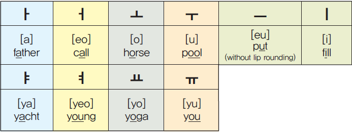
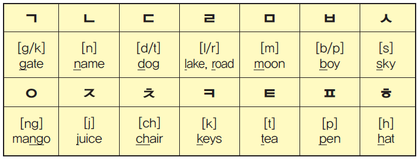
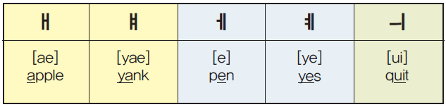
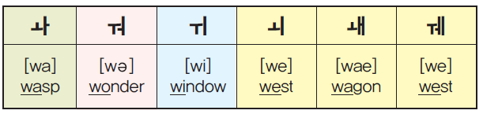
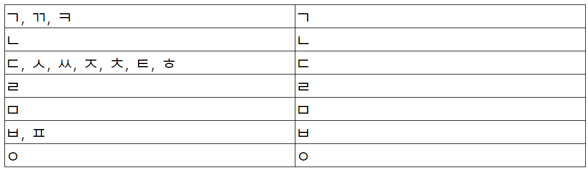
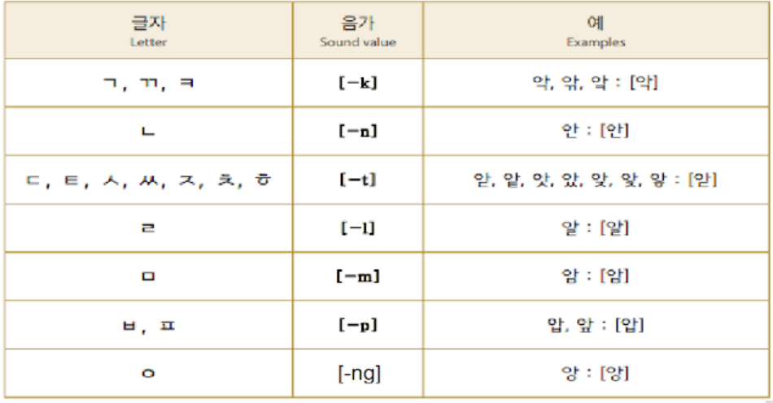
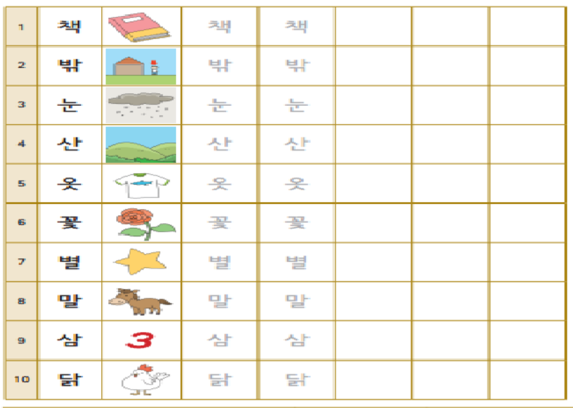

<!doctype html>
<html>
<head>
<title>1.기본모음 Simple Vowels</title>
<meta charset="utf-8">

<!-- Global site tag (gtag.js) - Google Analytics -->

<link rel="stylesheet" href="style.css">
</head>

<body>
  <h1><a href="0index.html">Tae's Korean V1</a></h1>

<ol>
<li><a href="1.기본 모음 Simple Vowels.html">기본 모음 Simple Vowels</a></li>
<li><a href="2.기본 자음 Simple Consonants.html">기본 자음 Simple Consonants</a></li>
<li><a href="3.음절 만들기 Syllable Formation.html">음절 만들기 Syllable Formation</a></li>
<li><a href="4.복합 모음 1 Compound Vowels 1.html">복합 모음 1 Compound Vowels 1</a></li>
<li><a href="5.복합 모음 2 Compound Vowels 2.html">복합 모음 2 Compound Vowels 2</a></li>
<li><a href="6.쌍자음 Double Consonants.html">쌍자음 Double Consonants</a></li>
<li><a href="7.종합연습 1 Excercise 1.html">종합연습 1 Excercise 1</a></li>
<li><a href="8.받침 1 Final Consonants - Bachim 1.html">받침 1 Final Consonants - Bachim 1</a></li>
<li><a href="9.받침 2 Final Consonants - Bachim 2.html">받침 2 Final Consonants - Bachim 2</a></li>
<li><a href="10종합연습 2 Exercise 2.html">종합연습 2 Exercise 2</a></li>
</ol>

<h2>1.기본모음 Simple Vowels</h2>

 In Korean there are basic vowels that you should take note of are the 10 basic vowels,these are
 ㅏ(a),ㅑ(ya),ㅓ(eo),ㅕ(yeo), ㅗ(o), ㅛ(yo), ㅜ(u), ㅠ(yu), ㅡ(eu), ㅣ(e)

<h3>a. Learn from video</h3>
<iframe width="560" height="315" src="https://www.youtube.com/embed/au_dHkWwrwA" frameborder="0" allow="accelerometer; autoplay; encrypted-media; gyroscope; picture-in-picture" allowfullscreen></iframe>

 <h3>b. Practive with consonant "ㅇ"</h3>
"ㅇ" is called [ee eung].
 This consonant doesn't have a sound. So if you read below, you will them as same as simple vowels.
  "아 야 어 여 오 요 우 유 으 이"
 Practice reding 아야어여오요우유으이 until you feel so comfortable with that sound. You can assume almost every korean kids memorized them.

  Today, you learned simple vowes!! yayy! :) 
 
 
 
 
 
 
 
 

  

  
  <noscript>Please enable JavaScript to view the <a href="https://disqus.com/?ref_noscript">comments powered by Disqus.</a></noscript>

  <!--Start of Tawk.to Script-->

<!--End of Tawk.to Script-->

</body>
</html>

<!doctype html>
<html>
<head>
<title>Welcome to Tae's Korean</title>
<meta charset="utf-8">

<!-- Global site tag (gtag.js) - Google Analytics -->

<link rel="stylesheet" href="style.css">
</head>

<body>
  <h1><a href="0index.html">Tae's Korean V1</a></h1>

<ol>
  <li><a href="1.기본 모음 Simple Vowels.html">기본 모음 Simple Vowels</a></li>
  <li><a href="2.기본 자음 Simple Consonants.html">기본 자음 Simple Consonants</a></li>
  <li><a href="3.음절 만들기 Syllable Formation.html">음절 만들기 Syllable Formation</a></li>
  <li><a href="4.복합 모음 1 Compound Vowels 1.html">복합 모음 1 Compound Vowels 1</a></li>
  <li><a href="5.복합 모음 2 Compound Vowels 2.html">복합 모음 2 Compound Vowels 2</a></li>
  <li><a href="6.쌍자음 Double Consonants.html">쌍자음 Double Consonants</a></li>
  <li><a href="7.종합연습 1 Excercise 1.html">종합연습 1 Excercise 1</a></li>
  <li><a href="8.받침 1 Final Consonants - Bachim 1.html">받침 1 Final Consonants - Bachim 1</a></li>
  <li><a href="9.받침 2 Final Consonants - Bachim 2.html">받침 2 Final Consonants - Bachim 2</a></li>
  <li><a href="10종합연습 2 Exercise 2.html">종합연습 2 Exercise 2</a></li>
</ol>

<h2>2.기본자음 simple Consonants</h2>

 ㄱ=g, ㄴ=n, ㄷ=d, ㄹ=r, ㅁ=m, ㅂ=b, ㅅ=s, ㅇ=silent, ㅈ=j, ㅊ=ch, ㅋ=k, ㅌ=t, ㅍ=p, ㅎ=h

<h3>Learn from video!</h3>

<iframe width="560" height="315" src="https://www.youtube.com/embed/1A5YQ0H5dZg" frameborder="0" allow="accelerometer; autoplay; encrypted-media; gyroscope; picture-in-picture" allowfullscreen></iframe>

I know it is not comfortable yet! but we will keep find some new words and will read! you are alreday came a lot. fighting!! 

           

  

  
  <noscript>Please enable JavaScript to view the <a href="https://disqus.com/?ref_noscript">comments powered by Disqus.</a></noscript>

  <!--Start of Tawk.to Script-->

<!--End of Tawk.to Script-->

</body>
</html>

<!doctype html>
<html>
<head>
<title>Welcome to Tae's Korean</title>
<meta charset="utf-8">
<!-- Global site tag (gtag.js) - Google Analytics -->

<link rel="stylesheet" href="style.css">

</head>

<body>
  <h1><a href="0index.html">Tae's Korean V1</a></h1>

<ol>
  <li><a href="1.기본 모음 Simple Vowels.html">기본 모음 Simple Vowels</a></li>
  <li><a href="2.기본 자음 Simple Consonants.html">기본 자음 Simple Consonants</a></li>
  <li><a href="3.음절 만들기 Syllable Formation.html">음절 만들기 Syllable Formation</a></li>
  <li><a href="4.복합 모음 1 Compound Vowels 1.html">복합 모음 1 Compound Vowels 1</a></li>
  <li><a href="5.복합 모음 2 Compound Vowels 2.html">복합 모음 2 Compound Vowels 2</a></li>
  <li><a href="6.쌍자음 Double Consonants.html">쌍자음 Double Consonants</a></li>
  <li><a href="7.종합연습 1 Excercise 1.html">종합연습 1 Excercise 1</a></li>
  <li><a href="8.받침 1 Final Consonants - Bachim 1.html">받침 1 Final Consonants - Bachim 1</a></li>
  <li><a href="9.받침 2 Final Consonants - Bachim 2.html">받침 2 Final Consonants - Bachim 2</a></li>
  <li><a href="10종합연습 2 Exercise 2.html">종합연습 2 Exercise 2</a></li>
</ol>

<h2>3.음절 만들기 Syllable Formation</h2>

가 나 다 라 마 바 사 아 자 차 카 타 파 하  
  I strongly recommend to practive this until you remember the sound. "가나다라마바사아자차카타파하"

<h2>b. Learn from Video!</h>

  <iframe width="560" height="315" src="https://www.youtube.com/embed/BzTxvEMDGFk" frameborder="0" allow="accelerometer; autoplay; encrypted-media; gyroscope; picture-in-picture" allowfullscreen></iframe>

 <h2>c. Let's practice</h2>
미소 [miso] : smile
 사다 [sada] : buy
 가다 [gada] : go
 오다 [oda]  : come
 보다 [boda] : see
 자다 [jada] : sleep
 

  

  
  <noscript>Please enable JavaScript to view the <a href="https://disqus.com/?ref_noscript">comments powered by Disqus.</a></noscript>

  <!--Start of Tawk.to Script-->

<!--End of Tawk.to Script-->

</body>
</html>

<!doctype html>
<html>
<head>
<title>Welcome to Tae's Korean</title>
<meta charset="utf-8">

<!-- Global site tag (gtag.js) - Google Analytics -->

<link rel="stylesheet" href="style.css">

</head>

<body>
  <h1><a href="0index.html">Tae's Korean V1</a></h1>

<ol>
  <li><a href="1.기본 모음 Simple Vowels.html">기본 모음 Simple Vowels</a></li>
  <li><a href="2.기본 자음 Simple Consonants.html">기본 자음 Simple Consonants</a></li>
  <li><a href="3.음절 만들기 Syllable Formation.html">음절 만들기 Syllable Formation</a></li>
  <li><a href="4.복합 모음 1 Compound Vowels 1.html">복합 모음 1 Compound Vowels 1</a></li>
  <li><a href="5.복합 모음 2 Compound Vowels 2.html">복합 모음 2 Compound Vowels 2</a></li>
  <li><a href="6.쌍자음 Double Consonants.html">쌍자음 Double Consonants</a></li>
  <li><a href="7.종합연습 1 Excercise 1.html">종합연습 1 Excercise 1</a></li>
  <li><a href="8.받침 1 Final Consonants - Bachim 1.html">받침 1 Final Consonants - Bachim 1</a></li>
  <li><a href="9.받침 2 Final Consonants - Bachim 2.html">받침 2 Final Consonants - Bachim 2</a></li>
  <li><a href="10종합연습 2 Exercise 2.html">종합연습 2 Exercise 2</a></li>
</ol>

<h2>4. 복합모음1 Compound Vowels1</h2>

<h2>a. Learn from the video!</h2>

  <iframe width="560" height="315" src="https://www.youtube.com/embed/au_dHkWwrwA" frameborder="0" allow="accelerometer; autoplay; encrypted-media; gyroscope; picture-in-picture" allowfullscreen></iframe>

 <h2>b. Let's Practice!!</h2>

 "애 얘 에 예 의"
 
 새 [sae] : bird
 네 [ne] : yes
 가게 [gage] : store
 계기 [gye gi] : turning point
 의사 [ui sa] : doctor
 예의 [ye ui] : courtesy, politeness
     

  

  
  <noscript>Please enable JavaScript to view the <a href="https://disqus.com/?ref_noscript">comments powered by Disqus.</a></noscript>

  <!--Start of Tawk.to Script-->

<!--End of Tawk.to Script-->

</body>
</html>

<!doctype html>
<html>
<head>
<title>Welcome to Tae's Korean</title>
<meta charset="utf-8">

<!-- Global site tag (gtag.js) - Google Analytics -->

<link rel="stylesheet" href="style.css">
</head>

<body>
  <h1><a href="0index.html">Tae's Korean V1</a></h1>

<ol>
  <li><a href="1.기본 모음 Simple Vowels.html">기본 모음 Simple Vowels</a></li>
  <li><a href="2.기본 자음 Simple Consonants.html">기본 자음 Simple Consonants</a></li>
  <li><a href="3.음절 만들기 Syllable Formation.html">음절 만들기 Syllable Formation</a></li>
  <li><a href="4.복합 모음 1 Compound Vowels 1.html">복합 모음 1 Compound Vowels 1</a></li>
  <li><a href="5.복합 모음 2 Compound Vowels 2.html">복합 모음 2 Compound Vowels 2</a></li>
  <li><a href="6.쌍자음 Double Consonants.html">쌍자음 Double Consonants</a></li>
  <li><a href="7.종합연습 1 Excercise 1.html">종합연습 1 Excercise 1</a></li>
  <li><a href="8.받침 1 Final Consonants - Bachim 1.html">받침 1 Final Consonants - Bachim 1</a></li>
  <li><a href="9.받침 2 Final Consonants - Bachim 2.html">받침 2 Final Consonants - Bachim 2</a></li>
  <li><a href="10종합연습 2 Exercise 2.html">종합연습 2 Exercise 2</a></li>
</ol>

<h2>5. 복합 모음2 Compound Vowels2</h2>

<h2>a. Learn from the video</h2>

<iframe width="560" height="315" src="https://www.youtube.com/embed/5cPBTIykoio" frameborder="0" allow="accelerometer; autoplay; encrypted-media; gyroscope; picture-in-picture" allowfullscreen></iframe>

 <h2>b. Let's Practice!!</h2>

 "와 워 위 외 왜 웨"
 
 과자 [gwa ja] : snack, chip, cookie
 뭐 [mwo] : what?
 쉬 [shwi] : pee, shee
 죄 [jwe] : guilt
 왜 [wae] : why
 웨이트 [we i tui] : weight (trainning)

     

  

  
  <noscript>Please enable JavaScript to view the <a href="https://disqus.com/?ref_noscript">comments powered by Disqus.</a></noscript>

  <!--Start of Tawk.to Script-->

<!--End of Tawk.to Script-->

</body>
</html>

<!doctype html>
<html>
<head>
<title>Welcome to Tae's Korean</title>
<meta charset="utf-8">

<!-- Global site tag (gtag.js) - Google Analytics -->

<link rel="stylesheet" href="style.css">
</head>

<body>
  <h1><a href="0index.html">Tae's Korean V1</a></h1>

<ol>
  <li><a href="1.기본 모음 Simple Vowels.html">기본 모음 Simple Vowels</a></li>
  <li><a href="2.기본 자음 Simple Consonants.html">기본 자음 Simple Consonants</a></li>
  <li><a href="3.음절 만들기 Syllable Formation.html">음절 만들기 Syllable Formation</a></li>
  <li><a href="4.복합 모음 1 Compound Vowels 1.html">복합 모음 1 Compound Vowels 1</a></li>
  <li><a href="5.복합 모음 2 Compound Vowels 2.html">복합 모음 2 Compound Vowels 2</a></li>
  <li><a href="6.쌍자음 Double Consonants.html">쌍자음 Double Consonants</a></li>
  <li><a href="7.종합연습 1 Excercise 1.html">종합연습 1 Excercise 1</a></li>
  <li><a href="8.받침 1 Final Consonants - Bachim 1.html">받침 1 Final Consonants - Bachim 1</a></li>
  <li><a href="9.받침 2 Final Consonants - Bachim 2.html">받침 2 Final Consonants - Bachim 2</a></li>
  <li><a href="10종합연습 2 Exercise 2.html">종합연습 2 Exercise 2</a></li>
</ol>

<h2>6. 쌍자음 Double Consonants</h2>

<h2>Learn from the video!</h2>

  <iframe width="560" height="315" src="https://www.youtube.com/embed/3lgxZdjnifo" frameborder="0" allow="accelerometer; autoplay; encrypted-media; gyroscope; picture-in-picture" allowfullscreen></iframe>

 <h2>b. Let's Practice!!!</h2>

깨다 [kkae da] : wake up; break apart
 또라이 [ddo ra i] : nut job, insane
 싸우다 [ssa u da] : fight
 짜다 [jja da] : salty
 빠르다 [bba rui da] : fast, quick
 싸다 [ssada] : cheap

      

  

  
  <noscript>Please enable JavaScript to view the <a href="https://disqus.com/?ref_noscript">comments powered by Disqus.</a></noscript>

  <!--Start of Tawk.to Script-->

<!--End of Tawk.to Script-->

</body>
</html>

<!doctype html>
<html>
<head>
<title>Welcome to Tae's Korean</title>
<meta charset="utf-8">

<!-- Global site tag (gtag.js) - Google Analytics -->

<link rel="stylesheet" href="style.css">
</head>

<body>
  <h1><a href="0index.html">Tae's Korean V1</a></h1>

<ol>
  <li><a href="1.기본 모음 Simple Vowels.html">기본 모음 Simple Vowels</a></li>
  <li><a href="2.기본 자음 Simple Consonants.html">기본 자음 Simple Consonants</a></li>
  <li><a href="3.음절 만들기 Syllable Formation.html">음절 만들기 Syllable Formation</a></li>
  <li><a href="4.복합 모음 1 Compound Vowels 1.html">복합 모음 1 Compound Vowels 1</a></li>
  <li><a href="5.복합 모음 2 Compound Vowels 2.html">복합 모음 2 Compound Vowels 2</a></li>
  <li><a href="6.쌍자음 Double Consonants.html">쌍자음 Double Consonants</a></li>
  <li><a href="7.종합연습 1 Excercise 1.html">종합연습 1 Excercise 1</a></li>
  <li><a href="8.받침 1 Final Consonants - Bachim 1.html">받침 1 Final Consonants - Bachim 1</a></li>
  <li><a href="9.받침 2 Final Consonants - Bachim 2.html">받침 2 Final Consonants - Bachim 2</a></li>
  <li><a href="10종합연습 2 Exercise 2.html">종합연습 2 Exercise 2</a></li>
</ol>

<h2>7.종합연습 1</h2>
 
<h2>a. Let's Practice again!!</h2>

  

  
  <noscript>Please enable JavaScript to view the <a href="https://disqus.com/?ref_noscript">comments powered by Disqus.</a></noscript>

  <!--Start of Tawk.to Script-->

<!--End of Tawk.to Script-->

</body>
</html>

<!doctype html>
<html>
<head>
<title>Welcome to Tae's Korean</title>
<meta charset="utf-8">

<!-- Global site tag (gtag.js) - Google Analytics -->

<link rel="stylesheet" href="style.css">
</head>

<body>
  <h1><a href="0index.html">Tae's Korean V1</a></h1>

<ol>
  <li><a href="1.기본 모음 Simple Vowels.html">기본 모음 Simple Vowels</a></li>
  <li><a href="2.기본 자음 Simple Consonants.html">기본 자음 Simple Consonants</a></li>
  <li><a href="3.음절 만들기 Syllable Formation.html">음절 만들기 Syllable Formation</a></li>
  <li><a href="4.복합 모음 1 Compound Vowels 1.html">복합 모음 1 Compound Vowels 1</a></li>
  <li><a href="5.복합 모음 2 Compound Vowels 2.html">복합 모음 2 Compound Vowels 2</a></li>
  <li><a href="6.쌍자음 Double Consonants.html">쌍자음 Double Consonants</a></li>
  <li><a href="7.종합연습 1 Excercise 1.html">종합연습 1 Excercise 1</a></li>
  <li><a href="8.받침 1 Final Consonants - Bachim 1.html">받침 1 Final Consonants - Bachim 1</a></li>
  <li><a href="9.받침 2 Final Consonants - Bachim 2.html">받침 2 Final Consonants - Bachim 2</a></li>
  <li><a href="10종합연습 2 Exercise 2.html">종합연습 2 Exercise 2</a></li>
</ol>

<h2>8.받침1 - Final Consonants1</h2>

<h2>a. Learn from the video!</h2>

<iframe width="560" height="315" src="https://www.youtube.com/embed/J5jlg4C6kUo" frameborder="0" allow="accelerometer; autoplay; encrypted-media; gyroscope; picture-in-picture" allowfullscreen></iframe>

<h2>c. Excercise</h2>

눈[nun] : snow       돈[don] : money       산[san] : mountain
 곰[gom] : bear       봄[spring] :spring       김치[gimchi] : kimchi
 강[gang] : river       공[gong] : ball        가방[ga bang] : backpack
 달[dal] : moon        말[mal] : horse       불[bul] : <figure>
 입[ip] : mouth, lip       국[gug] : soup       낮[nat] : afternoon, daytime
 옷[ot] : clothes

           

  

  
  <noscript>Please enable JavaScript to view the <a href="https://disqus.com/?ref_noscript">comments powered by Disqus.</a></noscript>

  <!--Start of Tawk.to Script-->

<!--End of Tawk.to Script-->

</body>
</html>

<!doctype html>
<html>
<head>
<title>Welcome to Tae's Korean</title>
<meta charset="utf-8">

<!-- Global site tag (gtag.js) - Google Analytics -->

<link rel="stylesheet" href="style.css">
</head>

<body>
  <h1><a href="0index.html">Tae's Korean V1</a></h1>

<ol>
  <li><a href="1.기본 모음 Simple Vowels.html">기본 모음 Simple Vowels</a></li>
  <li><a href="2.기본 자음 Simple Consonants.html">기본 자음 Simple Consonants</a></li>
  <li><a href="3.음절 만들기 Syllable Formation.html">음절 만들기 Syllable Formation</a></li>
  <li><a href="4.복합 모음 1 Compound Vowels 1.html">복합 모음 1 Compound Vowels 1</a></li>
  <li><a href="5.복합 모음 2 Compound Vowels 2.html">복합 모음 2 Compound Vowels 2</a></li>
  <li><a href="6.쌍자음 Double Consonants.html">쌍자음 Double Consonants</a></li>
  <li><a href="7.종합연습 1 Excercise 1.html">종합연습 1 Excercise 1</a></li>
  <li><a href="8.받침 1 Final Consonants - Bachim 1.html">받침 1 Final Consonants - Bachim 1</a></li>
  <li><a href="9.받침 2 Final Consonants - Bachim 2.html">받침 2 Final Consonants - Bachim 2</a></li>
  <li><a href="10종합연습 2 Exercise 2.html">종합연습 2 Exercise 2</a></li>
</ol>

<h2>Double Final Consonants 겹받침</h2>

Double Final Consonants  'ㄳ', 'ㄵ', 'ㄼ, ㄽ, ㄾ', 'ㅄ'               ->                 [ㄱ, ㄴ, ㄹ, ㅂ]

<h2>a. Learn from the video</h2>

<iframe width="560" height="315" src="https://www.youtube.com/embed/cTHc8ggK-JQ" frameborder="0" allow="accelerometer; autoplay; encrypted-media; gyroscope; picture-in-picture" allowfullscreen></iframe>

<h2>c. Let's Practice!!</h2>

넋[넉]
 넋과[넉꽈]
 앉다[안따]
 여덟[여덜]
 넓다[널따]
 핥다[할따]
 값[갑]
 없다[업:따]

      

  

  
  <noscript>Please enable JavaScript to view the <a href="https://disqus.com/?ref_noscript">comments powered by Disqus.</a></noscript>

  <!--Start of Tawk.to Script-->

<!--End of Tawk.to Script-->

</body>
</html>

<!doctype html>
<html>
<head>
<title>Welcome to Tae's Korean</title>
<meta charset="utf-8">

<!-- Global site tag (gtag.js) - Google Analytics -->

<link rel="stylesheet" href="style.css">
</head>
<body>
  <h1><a href="0index.html">Tae's Korean V1</a></h1>

<ol>
  <li><a href="1.기본 모음 Simple Vowels.html">기본 모음 Simple Vowels</a></li>
  <li><a href="2.기본 자음 Simple Consonants.html">기본 자음 Simple Consonants</a></li>
  <li><a href="3.음절 만들기 Syllable Formation.html">음절 만들기 Syllable Formation</a></li>
  <li><a href="4.복합 모음 1 Compound Vowels 1.html">복합 모음 1 Compound Vowels 1</a></li>
  <li><a href="5.복합 모음 2 Compound Vowels 2.html">복합 모음 2 Compound Vowels 2</a></li>
  <li><a href="6.쌍자음 Double Consonants.html">쌍자음 Double Consonants</a></li>
  <li><a href="7.종합연습 1 Excercise 1.html">종합연습 1 Excercise 1</a></li>
  <li><a href="8.받침 1 Final Consonants - Bachim 1.html">받침 1 Final Consonants - Bachim 1</a></li>
  <li><a href="9.받침 2 Final Consonants - Bachim 2.html">받침 2 Final Consonants - Bachim 2</a></li>
  <li><a href="10종합연습 2 Exercise 2.html">종합연습 2 Exercise 2</a></li>
</ol>

<h2>10. 종합연습2  Excercise2</h2>

<h2>Let's keep practicing!!</h2>

  

  
  <noscript>Please enable JavaScript to view the <a href="https://disqus.com/?ref_noscript">comments powered by Disqus.</a></noscript>

  <!--Start of Tawk.to Script-->

<!--End of Tawk.to Script-->

</body>
</html>

<!doctype html>
<html>
<head>
<title>Welcome to Tae's Korean</title>
<meta charset="utf-8">

<!-- Global site tag (gtag.js) - Google Analytics -->

<link rel="stylesheet" href="style.css">
</head>

<body>

  <h1><a href="0index.html" id="a">TAE Korean</a></h1>

<ol>
  <li><a href="1.기본 모음 Simple Vowels.html">기본 모음 Simple Vowels</a></li>
  <li><a href="2.기본 자음 Simple Consonants.html">기본 자음 Simple Consonants</a></li>
  <li><a href="3.음절 만들기 Syllable Formation.html">음절 만들기 Syllable Formation</a></li>
  <li><a href="4.복합 모음 1 Compound Vowels 1.html">복합 모음 1 Compound Vowels 1</a></li>
  <li><a href="5.복합 모음 2 Compound Vowels 2.html">복합 모음 2 Compound Vowels 2</a></li>
  <li><a href="6.쌍자음 Double Consonants.html">쌍자음 Double Consonants</a></li>
  <li><a href="7.종합연습 1 Excercise 1.html">종합연습 1 Excercise 1</a></li>
  <li><a href="8.받침 1 Final Consonants - Bachim 1.html">받침 1 Final Consonants - Bachim 1</a></li>
  <li><a href="9.받침 2 Final Consonants - Bachim 2.html">받침 2 Final Consonants - Bachim 2</a></li>
  <li><a href="10종합연습 2 Exercise 2.html">종합연습 2 Exercise 2</a></li>
</ol>

<h2>What is this website for?</h2>

I am Taehwan Hwang who is from Seoul, South Korea and currently lives in NYC.
I love people all over the world. And my ultimate goal in my life is to help them.
I was thinkging what I can do for my friends. I found one thing, Wwhich is teaching and helping
my friends to learn korean. And I decided to make this website for them.
It is a small start. But I believe this small start will grow big. 

 

  

<h2>Why learning korean will open your eyes?</h2>

<iframe width="560" height="315" src="https://www.youtube.com/embed/guCCqwNnhs8" frameborder="0" allow="accelerometer; autoplay; encrypted-media; gyroscope; picture-in-picture" allowfullscreen></iframe>

As a person who have been trying to understanding and learning English,
I found a very important fact. Learning a language is learning a new cultrue, new world and new perspective.
A lot of people from Asia are learning western culture and it opened their eyes.
But still, mayn native english speakers don't have denough time to learn Asian culture.
Hopefully, this website can expand your perspective over the globe 

 

  

  
  <noscript>Please enable JavaScript to view the <a href="https://disqus.com/?ref_noscript">comments powered by Disqus.</a></noscript>

  <!--Start of Tawk.to Script-->

<!--End of Tawk.to Script-->

</body>
</html>
